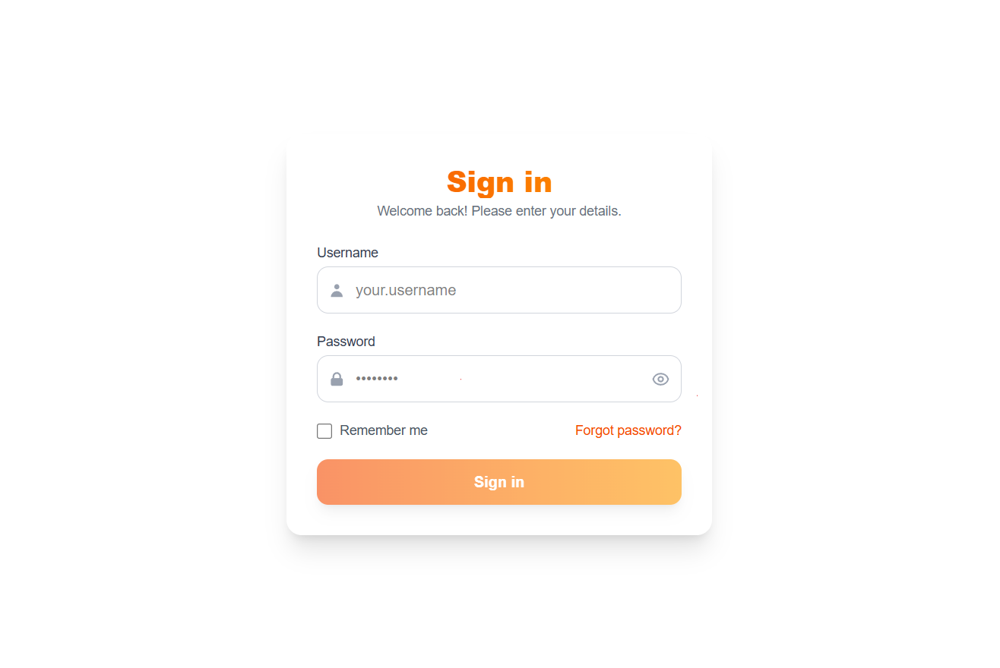
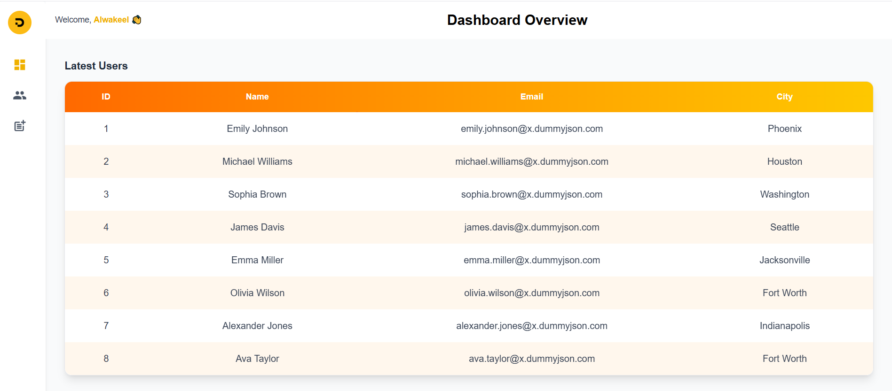

# 🖥️ Data Board  

🚀 A modern and scalable **admin dashboard** built with **React**, **Context API**, and **Tailwind CSS**.  
It features secure authentication, robust state management, and reusable UI components for managing **Users** and **Posts** efficiently.  
Optimized for performance, responsiveness, and clean design—making it both lightweight for developers and intuitive for end-users.  

---

## 🚀 Features  

### 🔑 User Authentication  
- Login form with **react-hook-form** + **zod** schema validation.  
- Protected routes via a custom **RequireAuth** component.  

### 👥 Users & Posts Management  
- Fetch, search, paginate, create, update, and delete **users** and **posts**.  
- Reusable `<Table />` supports **custom columns**, **actions**, and **loading/error states**.  

### 📱 Responsive UI/UX  
- Fully responsive layout powered by **Tailwind CSS**.  
- Smooth page transitions & animations with **AOS (Animate On Scroll)**.  

### 🧩 Reusable Components  
- Core building blocks like `DashboardLayout`, `Table`, `FormModal`, `Sidebar`, `Pagination`, `Button`, `Header`, `Loading`, `Notifications`, and `ErrorBoundary`.  
- Modular design for easy extension and scalability.  

### ⚠️ Error Handling & Edge Cases  
- **Client-side validation**: All form fields are validated before submission (e.g., required fields, email format).    
- Global **React ErrorBoundary** prevents unexpected crashes.  

---

## 🌐 APIs Used  

This project relies on dummy data provided by **[DummyJSON](https://dummyjson.com/)**:  

- 👥 **Users API** → `https://dummyjson.com/users`  
- 📝 **Posts API** → `https://dummyjson.com/posts`  

---

## 🏗️ Project Structure  

```
src/
├─ api/
│  ├─ postsApi.js  
│  └─ usersApi.js
├─ components/
│  ├─ DashboardLayout.jsx
│  ├─ Table.jsx
│  ├─ FormModal.jsx
│  ├─ Sidebar.jsx
│  ├─ Pagination.jsx
│  ├─ Button.jsx
│  ├─ Header.jsx
│  ├─ Loading.jsx
│  ├─ Notifications.jsx
│  └─ ErrorBoundary.jsx
├─ contexts/
│  ├─ AuthContext.jsx
│  ├─ UsersContext.jsx
│  └─ PostsContext.jsx
├─ pages/
│  ├─ Dashboard.jsx
│  ├─ Login.jsx
│  ├─ UsersList.jsx
│  └─ PostsList.jsx
├─ utils/
│  └─ schemas.js  
├─ App.jsx
├─ main.jsx
└─ index.css
```

---
## 📸 Screenshots  

### 🔑 Login Page  


### 🖥️ Dashboard  



## ⚡ Getting Started  

### 1️⃣ Clone the repository  
```bash
git clone https://github.com/AbdelrahmanHabib24/Data-board.git
cd Data-board
```

### 2️⃣ Install dependencies  
```bash
npm install
```

### 3️⃣ Run the development server  
```bash
npm run dev
```

## 🌐 Live Demo  
🔗 Netlify: [Data Board Live](https://databoard1.netlify.app/)  
🔗 GitHub: [Data Board Repository](https://github.com/AbdelrahmanHabib24/Data-board)  

---
